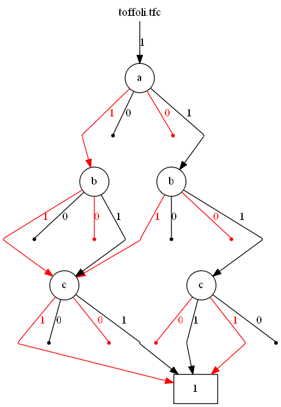

# Quantum Multiple-Valued Decision Diagram (QMDD)

See [report.pdf](report.pdf) for explanation and references.

To build and run, open qmdd.sln with Visual Studio 2017, build, and it should "just work". Pass a tfc file as a command line argument to specify which circuit to run. You can specify the input tfc filename through the "Debugging>Command Arguments" option in the Visual Studio project's properties.

## Example

Input:

```
.v a,b,c
.i a,b,c
.o a,b,c
BEGIN
t3 a,b,c
END
```

Output:

